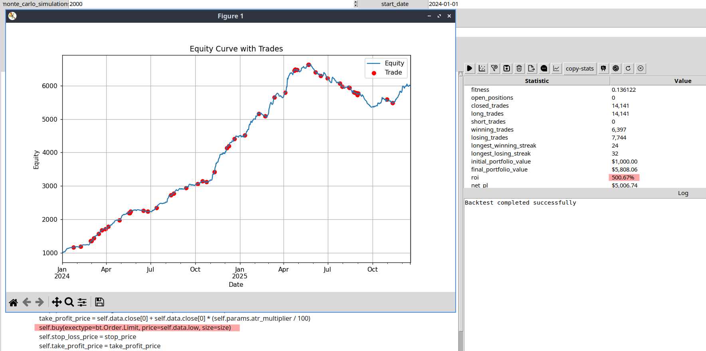

+++
title = "Look‑Ahead Traps in Backtesting (Backtrader, MQL, PineScript)"
author = "Josep Oriol Carné"
date = 2025-12-19
description = "Simple, practical examples of look‑ahead bias across Backtrader, MQL, and PineScript—and how to avoid it."
tags = ["backtesting", "look-ahead-bias", "backtrader", "pinescript", "mql", "trading"]
draft = false
+++

## Why This Matters

If a backtest seems to “forecast” the future without any explanatory edge, it probably does. The culprit is usually look‑ahead bias: using information you could not have known at the time of the decision.

Below are the most common categories, each with a tiny example and a safe fix. These patterns appear in Backtrader, MQL (MetaTrader), PineScript—really in every language and engine.



---

## 1) Using Future Bar Values

Symptom: The strategy decides using the current bar’s final values (like Close) and assumes an execution that benefits from that same bar’s information.

Backtrader (risky):

```py
def next(self):
    # Deciding on the close and (with coc=True) filling at the same close
    if self.data.close[0] > self.sma[0]:
        self.buy()  # with cerebro.broker.set_coc(True) this can look ahead
```

Backtrader (safe):

```py
# Default Backtrader fills on next bar open. Keep it that way for realism.
cerebro.broker.set_coc(False)  # ensure no cheat‑on‑close

def next(self):
    if self.data.close[-1] > self.sma[-1]:
        self.buy()  # order fills next bar open
```

PineScript (risky):

```pinescript
// Decides on current bar close and assumes immediate favorable fill
long = close > ta.sma(close, 50)
if long
    strategy.entry("L", strategy.long)
```

PineScript (safe):

```pinescript
// Confirmed signal from the previous bar; execute on next bar open
sig = ta.sma(close, 50)
long = close[1] > sig[1]
if long
    strategy.entry("L", strategy.long, when=barstate.isconfirmed)
```

MQL (risky):

```cpp
// Uses current bar's Close to decide and assumes instant fill at that Close
bool longSig = iClose(_Symbol, PERIOD_CURRENT, 0) > iMA(_Symbol, PERIOD_CURRENT, 50, 0, MODE_SMA, PRICE_CLOSE, 0);
if (longSig) OrderSend(_Symbol, OP_BUY, 0.1, Ask, 10, 0, 0);
```

MQL (safe):

```cpp
// Decide on closed bar (index 1), place order; fill occurs on next tick
double cPrev = iClose(_Symbol, PERIOD_CURRENT, 1);
double maPrev = iMA(_Symbol, PERIOD_CURRENT, 50, 0, MODE_SMA, PRICE_CLOSE, 1);
if (cPrev > maPrev) OrderSend(_Symbol, OP_BUY, 0.1, Ask, 10, 0, 0);
```

---

## 2) Repainting Indicators

Symptom: An indicator changes its past values as new data arrives (e.g., ZigZag, some custom oscillators, HTF aggregation during the bar).

PineScript (risky):

```pinescript
// HTF series without confirmation can repaint intrabar
htfClose = request.security(syminfo.tickerid, "60", close)
long = ta.crossover(close, htfClose)
```

PineScript (safe):

```pinescript
htfClose = request.security(syminfo.tickerid, "60", close, lookahead=barmerge.lookahead_off)
// Only trust when the HTF bar has closed
confirmed = request.security(syminfo.tickerid, "60", barstate.isconfirmed)
long = confirmed and ta.crossover(close, htfClose)
```

Backtrader notes:

- Prefer indicators that don’t revise history. If an indicator needs the full bar (esp. High/Low), use previous values (`[-1]`) for decisions.
- Avoid mixing `cheat_on_open` with indicators based on the same bar’s Close/High/Low.

---

## 3) Multi‑Timeframe Leakage

Symptom: Using higher‑timeframe (HTF) values that are not yet finalized on the current bar.

Backtrader (safe pattern):

```py
# Build HTF series via resample/replay and reference previous, closed value
cerebro.resampledata(data, timeframe=bt.TimeFrame.Minutes, compression=60)

def next(self):
    htf_prev = self.data1.close[-1]  # confirmed HTF close
    if self.data0.close[-1] > htf_prev:
        self.buy()
```

PineScript (safe): see the `barstate.isconfirmed` check above.

MQL (safe): decide using index 1 on HTF series so the bar is closed.

---

## Quick Red Flags

- Unrealistically clean equity curves, perfect tops/bottoms, or near‑zero drawdown.
- Signals change when you switch bar size but shouldn’t, given the logic.
- HTF logic looks amazing on LTF backtests but degrades massively live.
- Results collapse when you remove `coc/cheat` features or add tiny slippage.

---

## Safe Defaults Checklist

- Decide on the previous bar; execute next bar open.
- Turn off “cheat on close” modes unless you truly trade the close with real constraints.
- Treat HTF values as valid only after the HTF bar closes.
- Avoid repainting sources; prefer non‑revising indicators or lock values once the bar closes.
- Model slippage/fees and ambiguous OHLC intrabar paths conservatively.
- Backtest again with smaller bar sizes (or intrabar data) to sanity check.

---

## One‑Minute Sanity Test

1) Remove any cheat‑on‑close options (`cerebro.broker.set_coc(False)`; PineScript rely on confirmed bars).
2) Add 0.05% slippage and real commissions.
3) Shift all signals to use `[-1]` (previous bar) inputs.
4) Re‑run. If performance collapses, you likely had look‑ahead.

---

## Closing Thought

Backtests don’t “firecast” the future—bugs do. If results feel too sharp for the logic, assume leakage until you prove otherwise with stricter timing, confirmed data, and conservative fills.
