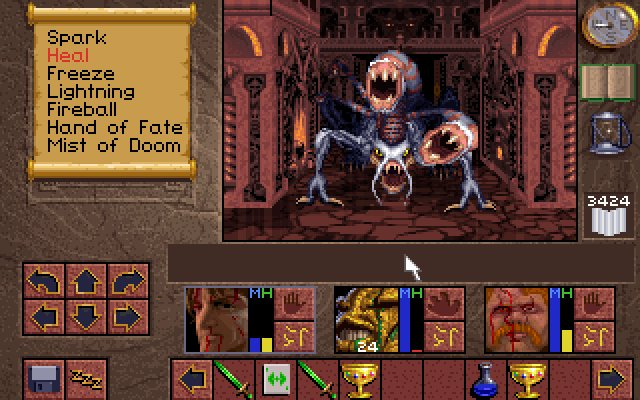

+++
title = 'Monthstalgia #2: Lands of Lore - Three Heroes, Same Castle, Zero Endings'
date = 2025-10-01T11:16:35+01:00
description = 'A nostalgic look at Lands of Lore: The Throne of Chaos, the RPG I played three times with different characters and never finished once.'
tags = ['monthstalgia', 'games', 'rpg', 'retro-gaming']
+++

Some games you finish. Some games finish you. And some games you play over and over, convinced that *this time* you'll figure it out—only to end up in the exact same place, wondering if the problem is the game or the player.

*Lands of Lore: The Throne of Chaos* (1993) was that game for me.

## The Setup

Westwood Studios (yes, the *Command & Conquer* people) created *Lands of Lore* as their take on the first-person dungeon crawler genre that *Eye of the Beholder* had popularized. The game opens with a simple choice: pick one of four champions to serve King Richard.

Each champion had different strengths:

- **Ak'shel** — The magic user. Powerful spells, fragile constitution.
- **Michael** — The fighter. Strong, durable, magically useless.
- **Conrad** — The rogue. Balanced stats, jack of all trades.
- **Kieran** — Another balanced option.

I was methodical. I was thorough. I played through with three different characters, each time convinced that my previous failures were due to choosing the wrong hero.

## Three Attempts, One Destination

**First playthrough: Ak'shel, the mage.**

Random choice. I progressed through forests and caves, hurling spells at everything that moved. Then I hit a wall—some section where my fragile wizard kept dying, probably due to running out of mana at the worst possible moment.

*Clearly*, I thought, *magic was the wrong approach. I need a fighter.*

**Second playthrough: Michael, the warrior.**

Brute force. No complicated spell management, just hit things until they stop moving. I got further—different sections, different challenges—but eventually found myself stuck again. Some puzzle, some encounter, something that strength alone couldn't solve.

*Obviously*, the solution was balance. *I need someone who can do both.*

**Third playthrough: Conrad, the rogue.**

The balanced approach. A little magic, a little fighting, adaptable to any situation. I progressed. I explored. I read the manual cover to cover, looking for hints I'd missed. I studied the game's systems like they were academic subjects.

And I ended up stuck. In the same castle. Again.

## The Manual Phase

This was the era when game manuals were actual books. *Lands of Lore* came with a proper manual full of lore, character descriptions, spell lists, and gameplay tips. I read it multiple times, convinced there was some secret I was missing.

There wasn't. Or if there was, I never found it.

I eventually concluded that the problem wasn't character choice. It wasn't strategy. It wasn't knowledge of game mechanics.

It was skill. Or more precisely: my lack of it.

## What I Remember Loving

Despite never finishing it, *Lands of Lore* left strong impressions:

- **The variety of environments** — Forests, caves, cities, castles, swamps, taverns... This feels standard today, but back then it was remarkable to me.
- **Temporary party members** — Characters who joined your campaign temporarily, adding depth and variety to the journey.
- **The Westwood quality** — The same studio that would create *Command & Conquer*. The production values were unmistakable.

## The Lesson

Sometimes you don't finish games. Sometimes you play them repeatedly, trying different approaches, reading every available guide, and still end up stuck in the same castle wondering what you're doing wrong.

And that's okay. The experience mattered more than the ending.

I never saw how *Lands of Lore* concluded. I have no idea what happened to Scotia or King Richard or the Throne of Chaos. But I still remember the game fondly after more than two decades—and that's the real victory.

---

*Monthstalgia is a monthly series about geeky things I remember fondly. Some I finished. Some finished me.*
